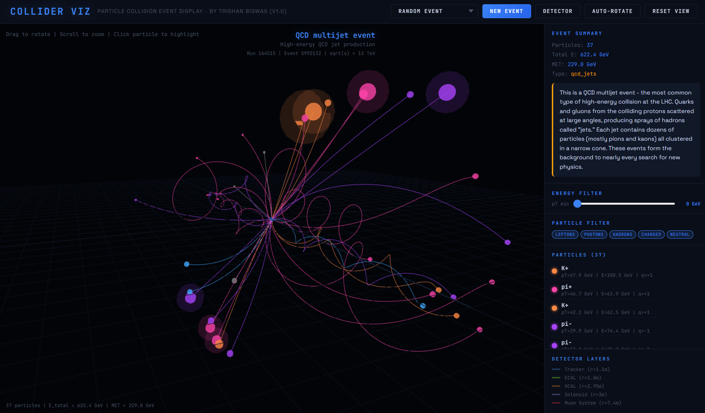
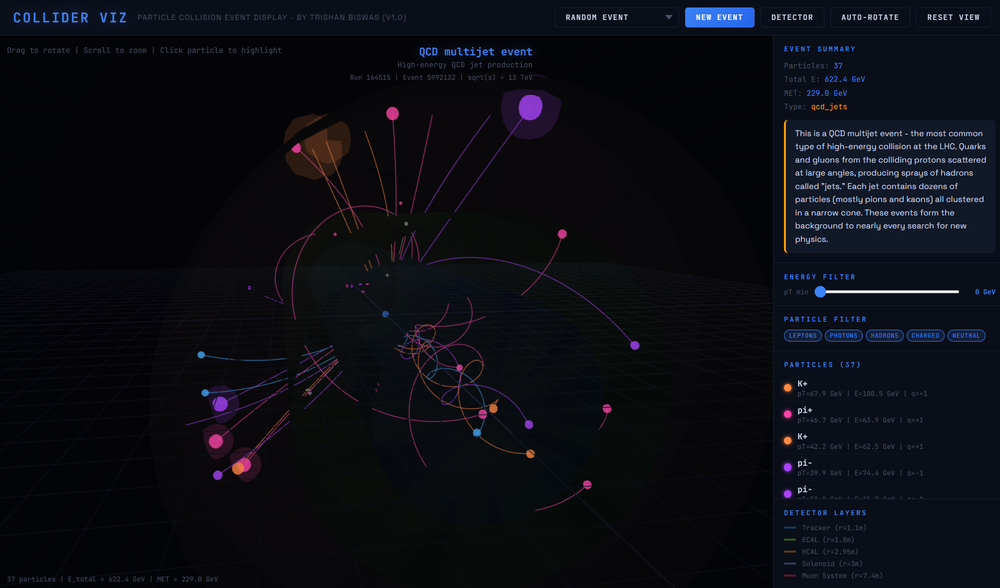
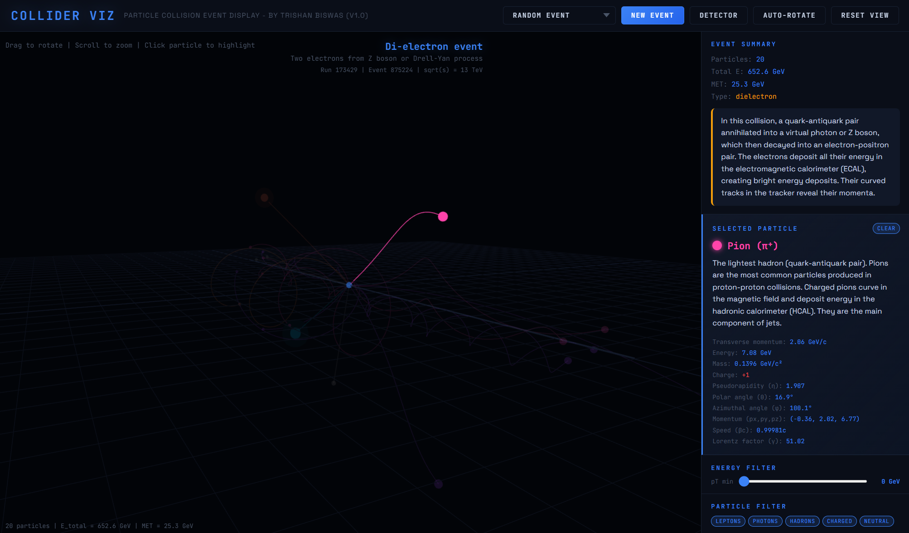

# Particle Collider Visualiser

<div align="center">

**A browser-based scientific event display for simulated high-energy particle collisions, detector geometry, particle tracks, and event-level kinematics.**

[Live Demo](https://particle-collider-visualiser.onrender.com) | [Run Locally](#run-locally) | [Event Types](#event-types) | [Technical Approach](#technical-approach) | [API](#api)

</div>



## At A Glance

| Area | Details |
| --- | --- |
| Interface | Three.js event display with camera controls, filters, and particle inspection |
| Backend | FastAPI event API with procedural physics generation |
| Physics focus | Lepton signatures, QCD jets, detector layers, magnetic-field track curvature |
| Detector model | Simplified CMS-style tracker, ECAL, HCAL, solenoid, and muon chambers |
| Event modes | Z peak, Higgs to four leptons, di-muon, di-electron, top pair, QCD jets |
| Deployment | Live Render deployment plus local FastAPI server |

## Overview

Particle Collider Visualiser is an interactive 3D event-display tool for simulated particle physics collisions. It generates Standard Model-inspired collision events, projects charged and neutral particle trajectories through a simplified CMS-style detector, and lets users inspect the particles, tracks, filters, detector layers, and event narrative in the browser.

The project is built as a portfolio-grade scientific visualisation system: visually accessible enough to explore quickly, but grounded in real collider concepts such as lepton signatures, QCD jets, detector layers, transverse momentum, magnetic-field curvature, missing transverse energy, and event topology.

## Why This Matters

Collider data is difficult to reason about directly because the interesting physics is hidden inside high-dimensional event records. Event displays make those records interpretable by turning particle kinematics, detector interactions, and event signatures into something spatial and inspectable.

This project sits in the same direction as my broader scientific tooling work: building interfaces that make complex physical systems easier to debug, explain, and explore.

## Scientific Tooling Angle

The goal is not to claim detector-grade reconstruction. The goal is to build a readable event-display layer: generated event records become visible tracks, detector interactions, filters, and particle-level metadata that can be inspected in real time.

That makes this project a stepping stone toward more serious physics tooling: event import formats, invariant-mass reconstruction, comparison views, and eventually real/open data integration.

## Screenshots

| Event display | Detector layers | Particle inspection |
| --- | --- | --- |
|  |  |  |

## What It Simulates

- Proton-proton collision event categories inspired by common LHC signatures
- Helical charged-particle tracks in a 3.8 T magnetic field
- Straight-line neutral-particle trajectories
- Simplified CMS-style detector geometry
- Event-level quantities such as total visible energy and missing transverse energy
- Particle-level kinematics including momentum, energy, pseudorapidity, azimuth, and Lorentz factor
- Detector interaction behaviour for leptons, photons, hadrons, and invisible particles

## Features

- **3D event display**: interactive Three.js viewport with orbit, zoom, pan, and auto-rotation
- **Selectable event types**: generate specific physics signatures rather than only random events
- **Detector geometry**: transparent tracker, ECAL, HCAL, solenoid, and muon-system layers
- **Particle inspection**: click tracks or particle rows to inspect kinematics and explanations
- **Filtering controls**: isolate leptons, hadrons, photons, charged particles, neutral particles, or high-pT tracks
- **Track highlighting**: focus one particle while dimming the rest of the event
- **Physics narratives**: each event type includes a short explanation of the generated process
- **API-backed generation**: FastAPI endpoints serve events, detector data, particle catalogues, and batches

## Event Types

| Event | API type | What to look for |
| --- | --- | --- |
| Z boson decay | `zpeak` | Clean lepton pair near the Z mass peak, around 91 GeV |
| Higgs to 4 leptons | `higgs_4l` | Four-lepton golden-channel-style topology near 125 GeV |
| Di-muon | `dimuon` | Opposite-sign muon pair traversing the detector |
| Di-electron | `dielectron` | Electron-positron pair stopping in the electromagnetic calorimeter |
| Top quark pair | `ttbar` | Multi-object event with jets, leptons, and missing transverse energy |
| QCD jets | `qcd_jets` | High-multiplicity sprays of hadrons from quark/gluon scattering |

## Technical Approach

### Event Generation

Events are generated procedurally using Monte Carlo-style sampling. Resonance-like processes produce lepton signatures, QCD events produce collimated hadronic sprays, and the underlying event adds softer particles from the rest of the collision.

The generator is not intended to replace a real detector simulation stack, but it does preserve the visual and conceptual structure of collider events: recognizable signatures, particle categories, momenta, detector interactions, and event-level metadata.

### Track Simulation

Charged particles curve through the solenoidal magnetic field using the transverse-momentum relation:

```text
r = pT / (0.3 * B * |q|)
```

Neutral particles propagate in straight lines. Different particle classes terminate in different detector regions:

- electrons and photons stop in the ECAL
- hadrons stop in the HCAL
- muons pass through to the muon system
- neutrinos contribute to missing transverse energy rather than visible tracks

### Detector Geometry

The detector is modelled as a simplified CMS-style cylindrical stack:

| Layer | Approximate radius |
| --- | ---: |
| Silicon tracker | 1.1 m |
| Electromagnetic calorimeter | 1.29-1.8 m |
| Hadronic calorimeter | 1.81-2.95 m |
| Superconducting solenoid | 2.95 m |
| Muon chambers | 4.0-7.4 m |

## Limitations

- The event generator is educational and procedural; it does not ingest real collision datasets yet.
- Detector geometry is simplified and is not a full Geant4/CMS detector model.
- Track propagation is approximate and designed for visual interpretation rather than reconstruction-grade analysis.
- Event rates, detector efficiencies, pileup, material interactions, and reconstruction uncertainties are not modelled in full.
- Invariant mass reconstruction is described through event narratives, but not yet exposed as a full analysis panel.

## Roadmap

- Add invariant-mass panels for lepton-pair and four-lepton events
- Add exportable event snapshots for reports and documentation
- Add JSON import/export for saved event records
- Add side-by-side comparison between selected event types
- Add optional real/open event dataset ingestion
- Add detector-hit overlays separate from generated truth tracks
- Add event-quality and topology summary panels
- Add stronger educational overlays for detector interactions and event signatures

## Current Focus

Particle Collider Visualiser is the public physics/scientific-tooling repo. The next useful step is to make the analysis layer stronger: invariant mass reconstruction, event summary panels, saved event records, and eventual support for importing simple real/open event data formats.

## Run Locally

```bash
git clone https://github.com/elegantmonark/particle-collider-visualiser.git
cd particle-collider-visualiser
pip install -r requirements.txt
uvicorn main:app --reload
```

Open [http://localhost:8000](http://localhost:8000) in your browser.

Requires Python 3.10+. If using a Python build without NumPy wheels, use a stable Python release such as Python 3.12.

## API

| Endpoint | Description |
| --- | --- |
| `GET /api/event` | Generate a random collision event |
| `GET /api/event?type=zpeak` | Generate a specific event type |
| `GET /api/batch?n=20` | Generate a batch of events |
| `GET /api/particles` | Return the particle catalogue |
| `GET /api/detector` | Return detector geometry constants |
| `GET /health` | Health check endpoint |

Supported event types:

```text
dimuon
dielectron
zpeak
higgs_4l
ttbar
qcd_jets
```

## Project Structure

```text
particle-collider-visualiser/
|-- main.py                 # FastAPI app and API routes
|-- physics.py              # Event generation, particles, detector geometry, tracks
|-- requirements.txt
|-- Procfile                # Render deployment entrypoint
|-- docs/
|   `-- screenshots/
|       |-- event-display.png
|       |-- detector-layers.png
|       `-- particle-inspection.png
|-- static/
|   `-- style.css           # Browser styling
`-- templates/
    `-- index.html          # Three.js event display frontend
```

## Author

**Trishan Biswas**

## License

[MIT License](LICENSE)
